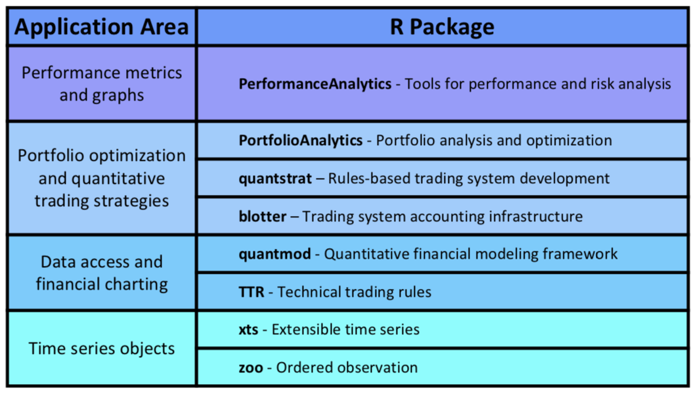
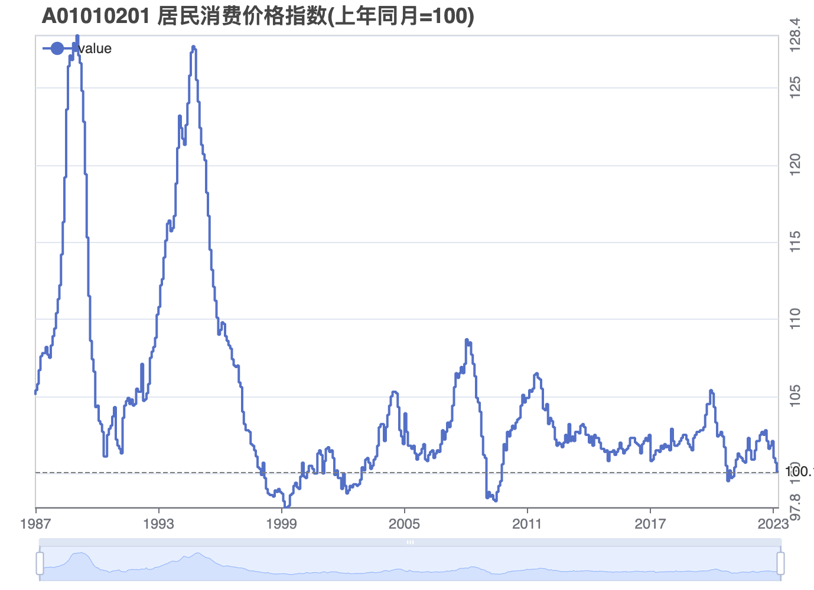
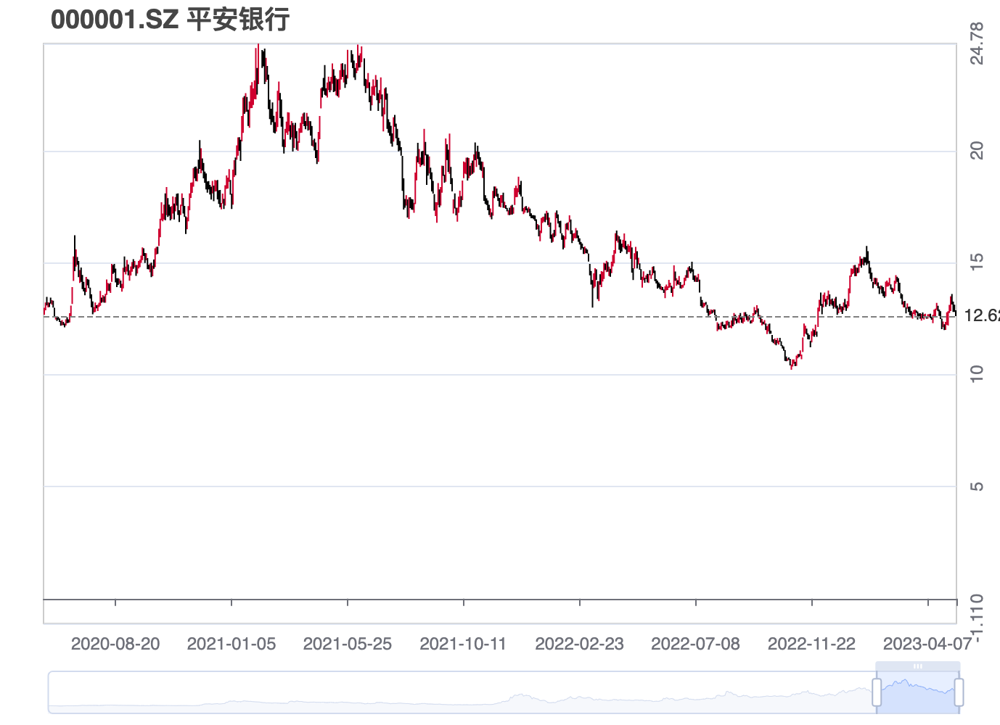
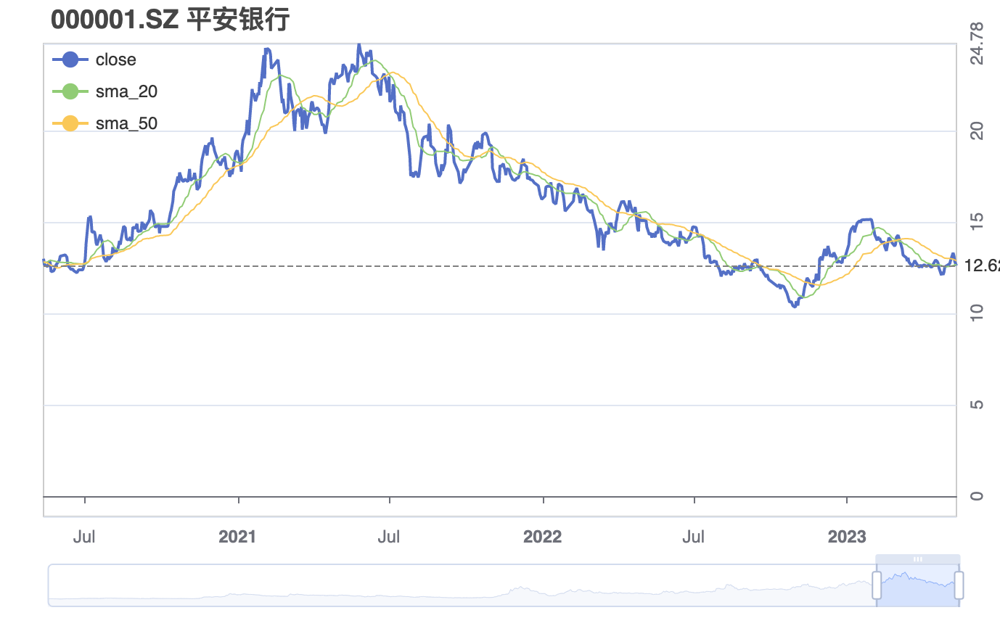
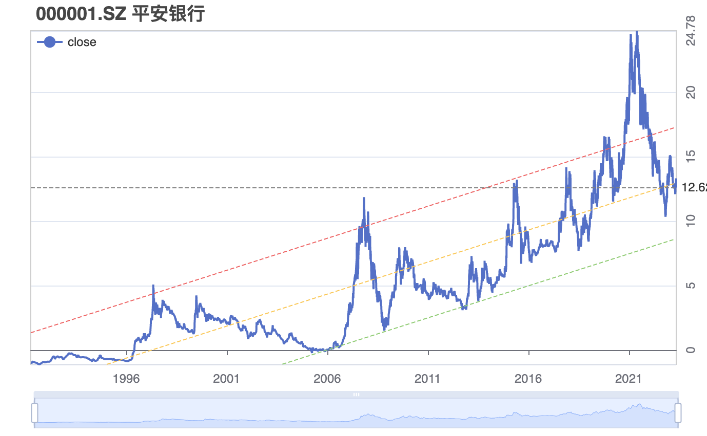
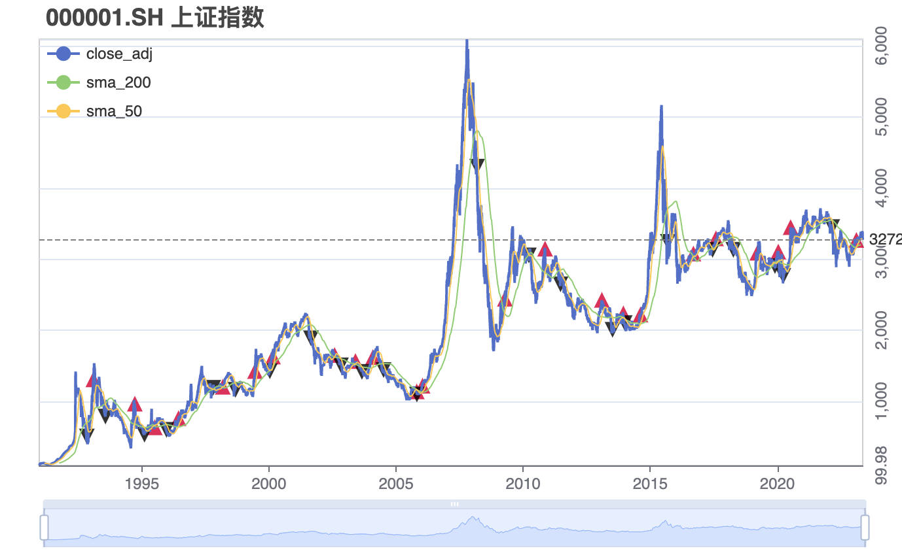

```{r setup, include=FALSE}
options(htmltools.dir.version = FALSE)
# names(xaringan:::list_css())
library(xaringan)
```

class: inverse, center, middle

# 1/4  简介

---
## 如何开始

.pull-left[
首先从 [CRAN](https://cran.r-project.org/web/packages/pedquant/index.html) 安装 **pedquant** (**P**ublic **E**conomic **D**ata and **Quant**itative Analysis) 包：
```r
install.packages('pedquant')
```

或者从 [GitHub](https://github.com/ShichenXie/pedquant) 安装最新版：
```r
devtools::install_github('shichenxie/pedquant')
```

**pedquant** 包的帮助文档参见 http://pedquant.com ， 
或查看R中相应的文档：
```r
help(package = 'pedquant')
```

]
.pull-right[
**pedquant** 包提供的函数主要分为三大类：

1. **ed_** (**e**conomic **d**ata 的缩写) 开头的函数，获取来自 [美联储经济数据 FRED](https://research.stlouisfed.org/)、 [中国人民银行 PBC](http://www.pbc.gov.cn/) (进行中)、 [国家统计局 NBS](http://data.stats.gov.cn/) 等机构的经济社会统计数据；

2. **md_** (**m**arket **d**ata 的缩写)开头的函数，获取来自 [雅虎财经 yahoo](https://finance.yahoo.com/) 的全球股票价格数据、 [网易财经 163](http://quotes.money.163.com/) 的上证与深证股票价格与财报数据、 [新浪财经 sina](https://finance.sina.com.cn/futuremarket/) 的国内期货价格数据等；

3. **pq_** (**p**ed**q**uant 的缩写)开头的函数，主要提供了一些数据预处理与可视化等相关功能。
]

---
## 相关R包

.pull-left[
- 常用的量化分析 R 包见下表<sup>*</sup>:


]

.pull-right[
- 左侧列出的 R 包大部分基于 xts (可扩展时间序列) 数据结构。

- 但以 data.frame (数据框) 为基础的数据处理工具包，例如 [tidyverse](http://tidyverse.org)、 [data.table](http://r-datatable.com)，更为大家所熟悉。[tidyquant](https://github.com/business-science/tidyquant) 将量化分析常用功能与 [tidyverse](http://tidyverse.org) 很好的结合起来。

- [pedquant](https://github.com/shichenxie/pedquant) 提供了类似于 [quantmod](https://github.com/joshuaulrich/quantmod) 的功能，但是基于 [data.table](http://r-datatable.com) 包开发，而且提供了我国所特有的财经数据。

]


.footnote[[*] 参考 [Guy Yollin. Introduction to Trading Systems](http://www.r-programming.org/papers)。]

---

class: inverse, center, middle

# 2/4 获取数据


---
## 经济社会统计数据

加载包并查看版本，后面将展示部分主要函数的功能。
```{r pkg}
library(data.table)
library(pedquant)
packageVersion('pedquant')
```

.pull-left[
- `ed_nbs` 函数可查询国家统计局 NBS 数据（以 `ed_` 开头的函数可以不用输入参数，而通过交互的方式设定）。
- 其中，`symbol` 与 `subregion` 两个参数可分别通过 `ed_nbs_symbol` 与 `ed_nbs_subregion` 函数获得。
]
.pull-right[
- `ed_fred` 函数可获取美联储经济数据 FRED。目前该数据库覆盖了87个数据源，拥有53万个美国或国际的数据指标。
- 其中，`symbol` 参数可以通过 `ed_fred_symbol` 函数获取，或者到 FRED 网站上查询。
]

---
class: clear 

.pull-left[
```{r cpicn}
# cpi of China
dt_cpicn = ed_nbs(
  symbol = c('A01010101','A01010201'), 
  freq = 'monthly', geo_type = 'nation', 
  date_range = 'max', na_rm = TRUE)
# data sturcture
str(head(dt_cpicn[[1]],1))
```
]

.pull-righ[
```{r cpius}
# cpi of US
dt_cpius = ed_fred(
  symbol = 'FLEXCPIM159SFRBATL', 
  date_range = 'max', print_step=0)

# data sturcture 
str(head(dt_cpius[[1]],1))
```
]


---
## 市场数据

- `md_stock` 函数获取股价历史与实时数据，支持上证、深证、港股、美股。

.pull-left[
```{r}
dt_pingan = md_stock('000001', date_range = 'max', forward=FALSE, print_step=0)
str(dt_pingan[[1]][.N])
```
]
.pull-right[
```{r, warning=FALSE}
dt_apple = md_stock('aapl', date_range = 'max', forward=FALSE, print_step=0)
str(dt_apple[[1]][.N])
```
]

---
class: clear

- `md_stock_financials` 函数获取A股上市公司财报，包括摘要、利润表、资产负债表、现金流量表

```{r fs}
dt_fs = md_stock_financials(type='fs0_summary', to = '2022-12-31', colnam_chn = TRUE)
str(dt_fs[[1]][1:2])
```


---
class: inverse, center, middle

# 3/4 数据预处理与可视化

---
## 技术分析指标


.pull-left[
- `pq_addti` 函数对TTR包的函数进行了适当封装，便于创建技术分析指标。

```{r}
dt_ti = pq_addti(dt_pingan, sma = list(n=20), sma = list(n=50), 
                 macd = list(), col_kp = FALSE)

tail(dt_ti[[1]],2)
```
]

.pull-right[
- 指标类别：
  - 根据指标功能可分为移动平均/趋势检测或强度指标/震荡指标/波动率指标/成交量指标/其它
  - 根据指标值类型分为overlays/indicators。
  
- TTR函数参数：
  - 价格/成交量/权重：
      - 不可修改参数，包括OHLC, HLC, HL and volume；
      - 可修改参数，包括price, prices, x。 均默认设为close或value；
      - 需要单独设置参数，包括y, w；
  - 数值参数：例如n, sd, v, nFast, nSlow, nSig, accel，均有默认值，但可以根据需要修改。
]

---
## 可视化
- `pq_plot` 函数使用了 `echarts4r` 包实现数据的动态可视化。

.pull-left[
```{r p1, out.width='100%', fig.height=6, eval=require('echarts4r'), tidy=FALSE}
# line chart
p1 = pq_plot(rbindlist(dt_cpicn)[, symbol := symbol[.N]], y='value',
    from = '2000-1-1', chart_type = 'step')
```

]
.pull-right[
```{r p2, fig.asp=0.8}
# candlestick chart
p2 = pq_plot(dt_pingan, date_range = '3y', 
             chart_type = 'candle')
```

]

---
class: clear
.pull-left[
```{r p3, fig.asp=0.8}
# addti
p3 = pq_plot(dt_pingan, date_range = '3y', 
    chart_type = 'line', 
    addti = list(sma=list(n=20), sma=list(n=50)))
```

]
.pull-right[
```{r p4, fig.asp=0.8}
# linear_trend 
p4 = pq_plot(dt_pingan, date_range = 'max', 
    chart_type = 'line',
    linear_trend = c(-0.8, 0, 0.8))
```

]

---
class: inverse, center, middle

# 4/4 策略开发

---
## 双均线策略

.pull-left[
```{r}
# load data
ssec = md_stock('^000001', date_range = 'max', print_step = 0)

# technical indicators
ssecti = pq_addti(ssec, x='close_adj', 
         sma=list(n=200), sma=list(n=50))

# crossover signals
dtorders = copy(ssecti[[1]])[
   sma_50 %x>% sma_200, `:=`(
     type = 'buy',  prices = close_adj)
 ][sma_50 %x<% sma_200, `:=`(
   type = 'sell', prices = close_adj)
 ][order(date)
 ][, (c('type', 'prices')) := lapply(.SD, shift), 
   .SDcols = c('type', 'prices')
 ][,.(symbol, name, date, close_adj, type, prices)]

```

]


.pull-right[
```{r}
# charting
pbt = pq_plot(ssec,  y='close_adj', 
      addti = list(sma=list(n=200), sma=list(n=50)), 
      orders = dtorders[!is.na(type)])
```


]

---
class: inverse, center, middle


